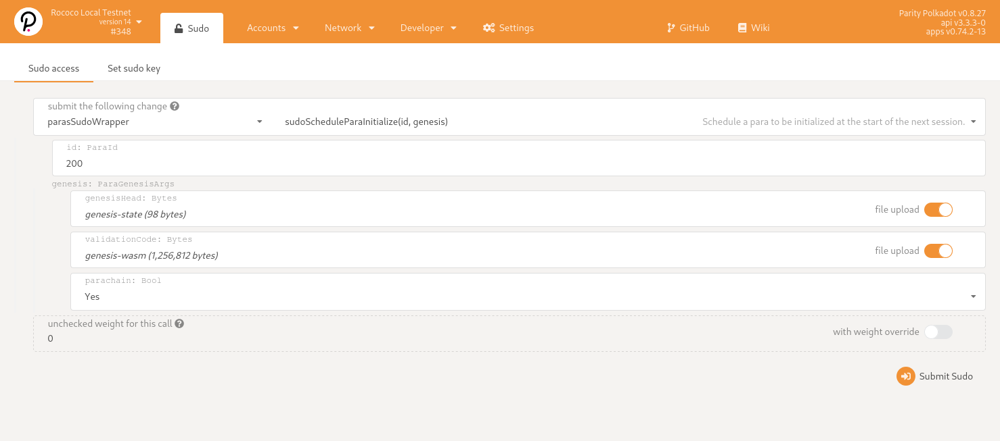

# Rococo - Local

## Relay Chain

```shell
git clone git@github.com:paritytech/polkadot.git
cd polkadot
git checkout 6f221717

cargo build --release --features=real-overseer

# Generate chain spec
./target/release/polkadot build-spec --chain rococo-local --disable-default-bootnode --raw > rococo-local.json

# Run 1st validator
./target/release/polkadot --chain rococo-local.json --alice --tmp --discover-local

# Run 2nd validator
./target/release/polkadot --chain rococo-local.json --bob --tmp --discover-local --port 30334
```

## Parachain

In the root of the BTC-Parachain directory:

```shell
cargo build --release

# Export genesis state
./target/release/btc-parachain export-genesis-state --parachain-id 200 > genesis-state

# Export genesis wasm
./target/release/btc-parachain export-genesis-wasm > genesis-wasm

# Run parachain collator
./target/release/btc-parachain --collator --discover-local --tmp --parachain-id 200 --port 40335 --ws-port 9946 -- --execution wasm --chain ../polkadot/rococo-local.json --port 30335 --discover-local
```

## Register

To register the Parachain, you can use the [Polkadot JS Apps UI](https://polkadot.js.org/apps/#/?rpc=ws://localhost:9944).



Add the [types](./types.json) to the developer settings if the app fails to decode any responses.